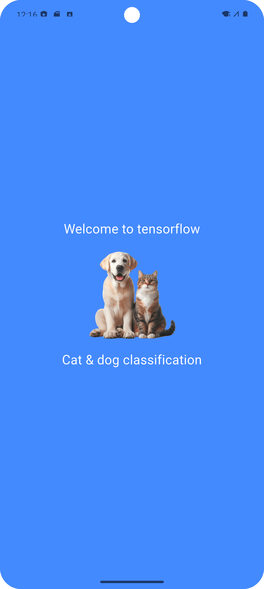
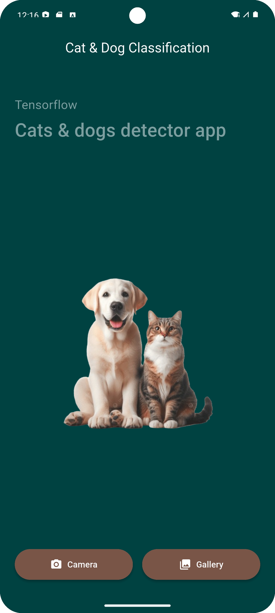

# 🐶🐱 Cat & Dog Classifier with Flutter & TensorFlow
[](LICENSE)  
[](https://flutter.dev)

## 🔍 Project Overview
এটি একটি মোবাইল অ্যাপ যেখানে আপনি আপনার ক্যামেরা বা গ্যালারি থেকে ছবি Upload করে দ্রুত যাচাই করতে পারবেন — ছবিতে কি **কুকুর (Dog)** আছে নাকি **বিড়াল (Cat)**। ব্যাকএন্ডে রয়েছে :contentReference[oaicite:1]{index=1} (বা TensorFlow Lite) মডেল এবং ফ্রন্টএন্ডে ব্যবহার করা হয়েছে :contentReference[oaicite:2]{index=2}।  
এটি শিক্ষণমূলক উদ্দেশ্যে তৈরি করা হয়েছে — আসলে আপনি আপনার মতো করে মডেল সাজাতে ও অ্যাপে ইন্টিগ্রেট করতে পারবেন।

## 🚀 Features
- 📱 **Flutter ইন্টারফেস** — এক কোডবেসে Android ও iOS সমর্থন।
- 🧠 **TensorFlow মডেল ইন্টিগ্রেশন** — ছবিতে বিড়াল বা কুকুর সনাক্ত করতে সক্ষম।
- 📸 **রিয়েল-টাইম ক্যামেরা অথবা গ্যালারি থেকে ছবি নির্বাচন**।
- ✅ **সহজ UI ও UX** — দ্রুত ফলাফল দেখাবে।
- 📂 **অ্যাসেট ও মডেল ফাইলকে সহজেই পরিবর্তনযোগ্য** — আপনি আপনার নিজের ডেটাসেট দিয়ে কাস্টমাইজ করতে পারবেন।
- 🔧 **মডুলার কোড স্ট্রাকচার** — পরবর্তী উন্নয়নের জন্য প্রস্তুত।

## 📸 Screenshots
স্ক্রিনশট:  
|  |  |  
|---|---|  
| Splash | Home + Result UI (Cat / Dog) |

## 🛠️ Getting Started
### Prerequisites
- Flutter SDK (≥ 3.x) ইনস্টল করা থাকতে হবে।
- Android Studio বা VS Code (Flutter প্লাগিন সহ)।
- একটি অ্যাসেট ফোল্ডারে প্রি-ট্রেইনড মডেল (.tflite ইত্যাদি) রয়েছে।

### Installation
```bash
git clone https://github.com/prothesbarai/cat_dog_classifier_tensorflow_with_flutter.git
cd cat_dog_classifier_tensorflow_with_flutter
flutter pub get
flutter run
```

### Download Apps
[](Download Apps) 